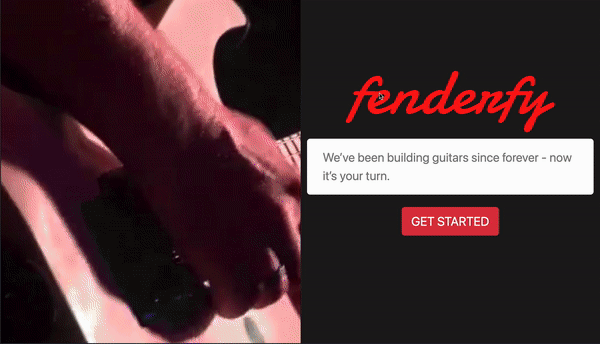

# Fenderfy


The idea behind this project is to conceptualize what [Fender's](https://shop.fender.com/en-US/mod-shop.html) page could look like if their team was to start using a more modern approach to their "guitar builder" section. I don't mean to sound pretentious, though. This is my own take on what it could look like.



## Run Locally

Clone the project

```bash
  git clone  https://github.com/carlosblanc0/fenderfy.git
```

Go to the project directory

```bash
  cd fenderfy
```

Install dependencies

```bash
npm install 
```

Start the server

```bash
  npm run start
```
 

 ## Live Demo
>  https://try-fenderfy.netlify.app


## Acknowledgements

 - [drcmda](https://github.com/drcmda)

## Appendix and FAQ

**Find this document incomplete?** Open an issue and I will get on it ASAP!

###### tags: `3D-Models` `Three.js` `Blender` `WebGL`

  
